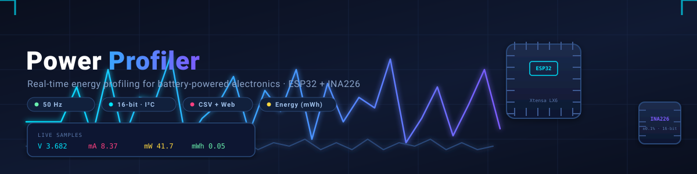
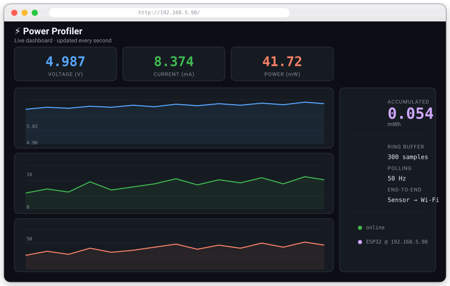
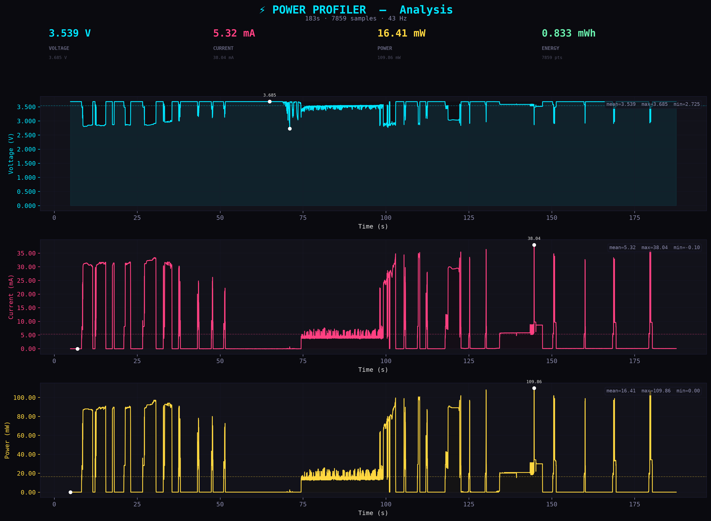
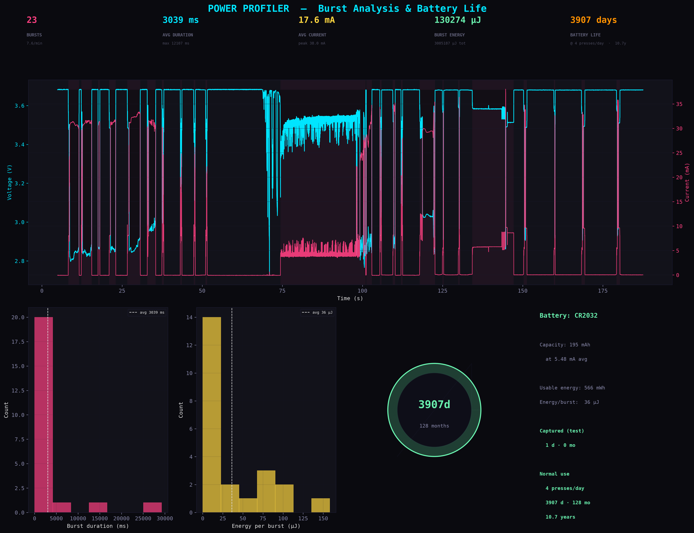

<p align="center">
  
</p>

<p align="center">
  <a href="https://github.com/espressif/esp-idf"></a>
  <a href="#"></a>
  <a href="#"></a>
  <a href="#"></a>
  <a href="#"></a>
  <a href="LICENSE"></a>
</p>

---

**Power Profiler** is a compact, real-time instrumentation tool for measuring **voltage**, **current**, **power** and **accumulated energy** of battery-powered and low-power electronics. Built around an **ESP32** and a **TI INA226** precision current sensor, it streams measurement data over serial *and* serves a live Chart.js dashboard over WiFi — with zero cloud dependencies.

> **The only instrument you need to know why your battery died.** Measure it, plot it, fix it.

<p align="center">
  
</p>

---

## Table of Contents

- [Key Features](#key-features)
- [Hardware](#hardware)
  - [Bill of Materials](#bill-of-materials)
  - [Wiring — INA226 → ESP32](#wiring--ina226--esp32)
  - [Shunt & Load Connection](#shunt--load-connection)
- [Getting Started](#getting-started)
  - [Prerequisites](#prerequisites)
  - [Build, Flash & Monitor](#build-flash--monitor)
  - [First Boot](#first-boot)
- [Web Dashboard](#web-dashboard)
  - [API Endpoints](#api-endpoints)
- [Serial Output](#serial-output)
- [Offline Analysis](#offline-analysis)
- [Configuration](#configuration)
- [Project Structure](#project-structure)
- [License](#license)

---

## Key Features

| | |
|---|---|
| ⚡ **High-resolution sensing** | INA226 (I²C, 16-bit ADC) with a 0.1 Ω shunt — ~24 µA current resolution, ±800 mA full scale |
| 🔋 **Voltage monitoring** | INA226 bus voltage (0–36 V, 1.25 mV LSB) *plus* an optional ADC channel with resistive divider |
| 🧮 **On-chip power math** | The INA226 computes power natively (VBUS × Current) at 25× the current-LSB resolution |
| 📈 **Live web dashboard** | Chart.js graphs of voltage, current & power with accumulated energy (mWh) — served over WiFi, no cloud |
| 🖨️ **Serial CSV stream** | `timestamp_ms,voltage_v,current_ma,power_mw` at 50 samples/s for plotting or logging |
| 🕸️ **WiFi-native** | Connects to your network and serves the dashboard on port 80 |
| 🚨 **Configurable alert** | Over-voltage/current/power alert on GPIO 19, handled by a hardware ISR |
| 🧬 **Self-verification** | Boot-time check of INA226 Manufacturer ID (0x5449) and Die ID (0x2260) |
| 🔍 **Automatic I²C scan** | Probes the bus on boot — finds the module at 0x40, 0x41, 0x44 or 0x45 |
| 🧰 **Fully tunable** | Shunt value, divider ratio, sample rate, WiFi and alert thresholds are all compile-time `#define`s |

---

## Hardware

### Bill of Materials

| Qty | Part | Notes |
|---:|---|---|
| 1× | ESP32 dev board | Any ESP32 with a USB-UART bridge |
| 1× | INA226 module | I²C current/power monitor — most breakout boards expose `VCC, GND, SDA, SCL, ALE, VBS, IN+, IN-` |
| 1× | 0.1 Ω shunt | Usually **already onboard** the breakout module |
| 2× | 10 kΩ resistors | Optional voltage divider for the ADC path (INA226 VBUS already covers voltage) |
| 1× | Breadboard & jumper wires | Prototyping convenience |

### Wiring — INA226 → ESP32

Connect the breakout to the ESP32 as listed below: power the module from 3.3 V (or 5 V), tie the grounds together, and run the I²C bus to GPIO 21/22. The `ALE` alert line is optional.

| ESP32 | Signal | INA226 pin | Notes |
|------:|--------|-----------|-------|
| 3.3 V | Power | VCC | May also use 5 V |
| GND | Ground | GND | Common ground with the DUT |
| GPIO 21 | I²C SDA | SDA | Internal pull-up enabled |
| GPIO 22 | I²C SCL | SCL | Internal pull-up enabled |
| GPIO 19 | Alert | ALE | Active-low, negative-edge ISR |
| GPIO 34 | ADC | *(divider tap)* | Input-only (no pull). Optional: external 10 kΩ / 10 kΩ divider |

> **On VCC:** most INA226 breakout boards accept 3.3 V or 5 V. If the I²C scan finds no device, re-seat VCC to 5 V (e.g. the ESP32 `VIN` pin) and retry.

### Shunt & Load Connection

The INA226 measures current as a voltage drop across a shunt resistor placed **in series with the positive supply rail**, between the power source and the load. Wire it like this:

1. **Power source → shunt → load.** Cut the positive rail and insert the 0.1 Ω shunt between the power source and the load's `V+` terminal. Current must flow through the shunt into the load.
2. **IN+ → source side.** Connect `IN+` to the shunt terminal on the **power source** side.
3. **IN− → load side.** Connect `IN−` to the shunt terminal on the **load** side.
4. **VBS → load side.** Connect `VBS` (VBUS) to the **same node as `IN−`** (the load-side rail). VBUS senses the actual load voltage, so real power (P = V × I) is captured at the point of consumption.
5. **Common ground.** Tie the power source GND, load GND, INA226 GND and ESP32 GND together. All ground references must be shared.

Optionally, to read the load voltage through the ESP32 ADC instead of VBUS:

6. **ADC divider (optional).** Tap the load-side rail (same node as `VBS`/`IN−`) through a **10 kΩ resistor (`R1`)** to `GPIO 34`, and a second **10 kΩ resistor (`R2`)** from `GPIO 34` to GND. The 10 kΩ / 10 kΩ pair halves the voltage (0–5 V scaled to 0–2.5 V at the pin), which is the maximum the ESP32 ADC can read.

---

## Getting Started

### Prerequisites

- [ESP-IDF](https://github.com/espressif/esp-idf) **v5.x** with the `xtensa-esp32` toolchain
- A USB-UART cable for the ESP32 board
- A configured WiFi network (2.4 GHz)

### Build, Flash & Monitor

```bash
# One-time setup
. $IDF_PATH/export.sh
idf.py set-target esp32

# Build, flash & monitor in one shot
idf.py -p /dev/ttyUSB0 flash monitor
```

| | |
|---|---|
| Baud rate | 115200 |
| Exit monitor | `Ctrl+]` |
| Sample rate | 50 Hz (`SAMPLE_INTERVAL_MS` = 20) |

### First Boot

1. Set your network credentials — edit `WIFI_SSID` and `WIFI_PASS` in `main/main.c:25-26`
2. Build, flash and open the monitor
3. Note the assigned IP address in the boot log
4. Open `http://<esp32-ip>/` in your browser

```text
I (5308) profiler: WiFi connected — IP: 192.168.5.98
I (2016) profiler: I2C bus scan:
I (2016) profiler:   Device found at 0x44
I (2024) profiler: INA226 ready at 0x44
```

---

## Web Dashboard

Point your browser at `http://<esp32-ip>/` and watch live measurements. The page is served **directly from flash** (`main/web_page.h`) — no SPIFFS, no external files — and updates every second.

**What you get:**
- Three metric cards: **voltage (V)**, **current (mA)** and **power (mW)** — live values
- Three rolling line charts with the last **6 seconds** of history (300 samples @ 50 Hz)
- Accumulated **energy (mWh)** — the time-integral of power
- The ESP32's IP and a live clock in the footer

Chart.js is loaded from a CDN and rendered entirely client-side; the ESP32 is a passive data source.

<p align="center">
  
</p>

### API Endpoints

| Method | Path | Response |
|--------|------|----------|
| `GET` | `/` | Full HTML dashboard |
| `GET` | `/api/data` | `{"t":[...], "v":[...], "c":[...], "p":[...], "e":1.23}` — up to 300 samples |
| `GET` | `/api/latest` | `{"t":14237, "v":4.987, "c":8.37, "p":41.72, "e":0.05, "ip":"192.168.5.98"}` |

---

## Serial Output

A CSV stream at **50 samples/second** for capture with any serial tool or plotter:

```csv
timestamp_ms,voltage_v,current_ma,power_mw
1423,4.987,8.374,41.725
1443,4.985,8.350,41.520
```

| Column | Source | Description |
|--------|--------|-------------|
| `timestamp_ms` | FreeRTOS tick | Milliseconds since boot |
| `voltage_v` | INA226 VBUS | Bus voltage at the load |
| `current_ma` | INA226 Current Register | Current through the shunt |
| `power_mw` | INA226 Power Register | On-chip power (VBUS × I) |

Capture a session:

```bash
idf.py -p /dev/ttyUSB0 monitor > measurement.csv
```

---

## Offline Analysis

The companion `scripts/plot.py` turns captured CSV into publication-ready, cyberpunk-styled figures with **burst detection**, **peak/min tracking** and **CR2032 battery-life estimates** — perfect for profiling intermittent loads (radio beacons, sensors, remotes, wearables).

```bash
python3 scripts/plot.py measurement.csv            # 3-panel voltage/current/power
python3 scripts/plot.py measurement.csv --analyze  # + burst analysis & battery estimate
python3 scripts/plot.py measurement.csv --dual     # + split short vs long bursts
```

<p align="center">
  
  <em>Example capture: voltage, current and power of a battery-powered device.</em>
</p>

<p align="center">
  
  <em>Burst analysis highlights active periods and projects CR2032 battery life.</em>
</p>

---

## Configuration

Every tunable parameter is a `#define` at the top of `main/main.c`:

| Parameter | Default | Meaning |
|-----------|---------|---------|
| `WIFI_SSID` | `"Stella"` | WiFi network name |
| `WIFI_PASS` | — | WiFi password (edit before flashing) |
| `INA226_ADDR` | `0x44` | I²C address (auto-detected at boot) |
| `SHUNT_OHM` | `0.1` | Shunt resistor value (Ω) |
| `MAX_CURRENT_A` | `0.8` | Full-scale expected current (A) |
| `DIVIDER_R1` | `10000.0` | Top resistor of the external divider (Ω) |
| `DIVIDER_R2` | `10000.0` | Bottom resistor of the external divider (Ω) |
| `SAMPLE_INTERVAL_MS` | `20` | Sampling period — 50 Hz |
| `INA226_ALERT_GPIO` | `19` | Alert interrupt pin |
| `INA226_ALERT_MASK` | `INA226_ALERT_POL` | Power over-limit alert |
| `INA226_ALERT_LIMIT` | `10000` | Alert threshold (power LSBs) |

---

## Project Structure

```
power_profiller/
├── main/
│   ├── main.c               # App entry: WiFi, HTTP server, sensor task, CSV
│   ├── web_page.h           # Inline HTML/JS dashboard (Chart.js, dark theme)
│   ├── bsp/
│   │   ├── ina226_bsp.h     # INA226 BSP — enums, config struct, full API
│   │   └── ina226_bsp.c     # INA226 driver — all registers, alert ISR, verify
│   └── CMakeLists.txt
├── scripts/
│   └── plot.py              # Offline CSV analyzer: burst detection + battery life
├── docs/
│   ├── hero.svg             # README banner
│   ├── block-diagram.svg    # System architecture diagram
│   ├── dashboard.svg        # Web dashboard mockup
│   ├── controle*.png        # Example measurement & analysis figures
│   └── ina226.pdf           # TI INA226 datasheet
├── sdkconfig.defaults       # FreeRTOS 1000 Hz, WiFi STA, INFO log
├── CMakeLists.txt           # Root ESP-IDF project
├── AGENTS.md                # Agent build/hardware conventions
└── README.md
```

---

## License

MIT — see [LICENSE](LICENSE) for the full text.
