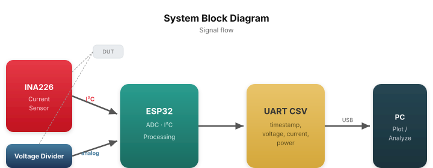
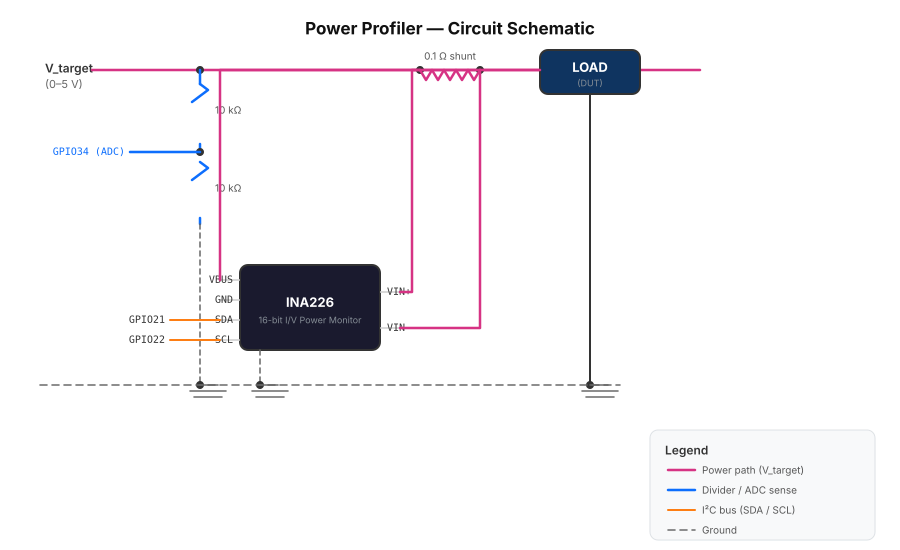

# Power Profiler

A low-cost power profiler built on the **ESP32** that measures voltage and current to generate real-time consumption graphs. Designed for profiling battery-powered or low-power devices in the 0–5 V / 0–800 mA range.



## Features

- **Current sensing** via INA226 (I2C, 16-bit ADC) with 0.1 Ω shunt — ~24 µA resolution
- **Voltage sensing** via resistive divider + ESP32 ADC — 0–5 V range
- **CSV output** over serial at 10 samples/s — ready for plotting scripts or serial plotters
- **Live web dashboard** via built-in WiFi — Chart.js graphs of voltage, current, power, and accumulated energy
- Fully configurable shunt value, divider ratio, and sample rate via `#define`

## Hardware

### Bill of Materials

| Qty | Part | Notes |
|-----|------|-------|
| 1 | ESP32 dev board | Any ESP32 with USB-UART |
| 1 | INA226 module | I2C current/power monitor, addr 0x40 |
| 1 | 0.1 Ω shunt resistor | Unless your INA226 module already has one |
| 2 | 10 kΩ resistors | For voltage divider (0.1% tolerance recommended) |
| 1 | Breadboard + wires | Or custom PCB |

### Schematic



### Pinout

| ESP32 GPIO | Signal | Direction | Connected to |
|------------|--------|-----------|--------------|
| 21 | I2C SDA | Bidir | INA226 SDA |
| 22 | I2C SCL | Output | INA226 SCL |
| 19 | Alert | Input | INA226 ALERT (active low, interrupt) |
| 34 | ADC1_CH6 | Input | Voltage divider tap (V_target / 2) |
| GND | Ground | — | INA226 GND, load GND, divider bottom |

**Notes:**
- GPIO 34 is input-only (no pull-up/pull-down) — ideal for analog sensing.
- ALERT pin (GPIO 19) uses negative-edge interrupt with internal pull-up. Configured in `main/main.c`.
- The voltage divider ratio is **0.5** (10 kΩ / 10 kΩ). To change the measurable voltage range, adjust the divider resistors and update `DIVIDER_R1` / `DIVIDER_R2` in `main/main.c`.
- The shunt resistor sets the maximum measurable current: 0.1 Ω → ~800 mA. For higher currents, use a smaller shunt (e.g., 0.01 Ω for ~8 A) and update `SHUNT_OHM` and `MAX_CURRENT_A`.
- INA226 I2C address is 0x40 by default. If using a module with A0/A1 pins strapped differently, update `INA226_ADDR`.

## Build & Flash

Requires [ESP-IDF](https://github.com/espressif/esp-idf) (v5.x recommended).

```bash
# One-time setup
. $IDF_PATH/export.sh
idf.py set-target esp32

# Build
idf.py build

# Flash and monitor
idf.py -p /dev/ttyUSB0 flash monitor
```

- Baud rate: 115200
- Exit monitor: `Ctrl+]`

## WiFi Setup

Edit `WIFI_SSID` and `WIFI_PASS` at the top of `main/main.c` before flashing:

```c
#define WIFI_SSID   "your-ssid"
#define WIFI_PASS   "your-password"
```

The ESP32 connects to your local WiFi on boot (blocks up to 30 seconds). Once connected, it prints its IP address via serial and starts the HTTP server.

## Web Dashboard

Open a browser to `http://<esp32-ip>/` to access the live dashboard:

- **Voltage (V)** — from the ADC divider, updated every second
- **Current (mA)** — from INA226, updated every second
- **Power (mW)** — computed by INA226 (V_bus × I)
- **Accumulated energy (mWh)** — integral of power over time
- All three signals plotted as rolling 30-second line charts using Chart.js

The dashboard is served directly from the ESP32 (no external hosting needed — the HTML/CSS/JS is inline in `main/web_page.h`).

## Output Format

CSV lines at **10 samples/second**:

```
timestamp_ms,voltage_v,current_ma,power_mw
1423,3.301,12.456,41.117
1523,3.302,12.389,40.908
...
```

Columns:
- `timestamp_ms` — milliseconds since boot
- `voltage_v` — load voltage from the ADC divider path
- `current_ma` — current through shunt (INA226)
- `power_mw` — power computed by INA226 (V_bus × I)

## Plotting

Pipe the serial output into a companion script or use any CSV-capable plotter:

```bash
# Save to file
idf.py -p /dev/ttyUSB0 monitor > data.csv

# Or use the companion plot script (TODO)
python scripts/plot.py --port /dev/ttyUSB0
```

For quick visualization, try [SerialPlot](https://github.com/hyOzd/serialplot) or gnuplot:

```gnuplot
set datafile separator ','
plot 'data.csv' every ::1 using 1:2 with lines title 'Voltage (V)', \
     '' every ::1 using 1:3 with lines title 'Current (mA)', \
     '' every ::1 using 1:4 with lines title 'Power (mW)'
```

## Configuration

All key parameters are `#define` at the top of `main/main.c`:

| Parameter | Default | Meaning |
|-----------|---------|---------|
| `SHUNT_OHM` | 0.1 | Shunt resistor value in ohms |
| `MAX_CURRENT_A` | 0.8 | Maximum expected current (for INA226 calibration) |
| `DIVIDER_R1` | 10000.0 | Top resistor of voltage divider (ohms) |
| `DIVIDER_R2` | 10000.0 | Bottom resistor of voltage divider (ohms) |
| `SAMPLE_INTERVAL_MS` | 100 | Time between samples (10 Hz default) |
| `INA226_ADDR` | 0x40 | I2C address |
| `WIFI_SSID` | `"Stella"` | WiFi network name |
| `WIFI_PASS` | `"…"` | WiFi password |

## Project Structure

```
power_profiller/
├── main/
│   ├── main.c               # App entry, WiFi, HTTP server, sensor task
│   ├── web_page.h           # Inline HTML/JS dashboard (Chart.js)
│   ├── bsp/
│   │   ├── ina226_bsp.h     # INA226 BSP header (enums, structs, API)
│   │   └── ina226_bsp.c     # INA226 BSP driver (all 10 registers, alert ISR)
│   └── CMakeLists.txt
├── CMakeLists.txt            # Root ESP-IDF project
├── sdkconfig.defaults        # FreeRTOS tick rate, log level, WiFi
├── AGENTS.md                 # Agent instructions for this repo
└── README.md
```

## License

MIT
